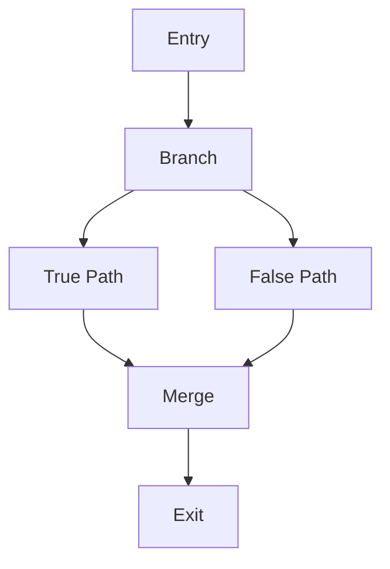

# Shader Translation System Documentation

## Overview
The VitaNS shader translation system converts PS Vita GXP shaders to optimized GLSL ES shaders for the Nintendo Switch's Tegra X1 GPU. The system supports a wide range of shader types and features, including advanced capabilities like mesh shaders, variable rate shading, and advanced texture compression.

## Supported Shader Types
- Vertex Shaders
- Fragment Shaders
- Geometry Shaders
- Tessellation Control Shaders
- Tessellation Evaluation Shaders
- Compute Shaders
- Mesh Shaders
- Task Shaders

## Advanced Features

### Mesh Shader Support
The mesh shader pipeline replaces the traditional vertex/geometry shader pipeline with a more flexible and efficient approach:

```glsl
// Example mesh shader usage
#version 450
#extension GL_NV_mesh_shader : require

layout(local_size_x = 32, local_size_y = 1, local_size_z = 1) in;
layout(triangles, max_vertices = 64, max_primitives = 32) out;

// Output attributes
layout(location = 0) out vec4 out_position[];
layout(location = 1) out vec2 out_texcoord[];
layout(location = 2) perprimitiveNV out vec3 out_normal[];

void main() {
    // Set output counts
    gl_PrimitiveCountNV = 32;
    gl_VertexCount = 64;
    
    // Generate mesh data
    for (int i = 0; i < gl_VertexCount; i++) {
        // Vertex processing
        out_position[i] = process_vertex(i);
        out_texcoord[i] = calculate_texcoord(i);
    }
    
    // Generate primitive data
    for (int i = 0; i < gl_PrimitiveCountNV; i++) {
        // Set indices for triangle i
        gl_PrimitiveIndicesNV[i * 3 + 0] = i * 3 + 0;
        gl_PrimitiveIndicesNV[i * 3 + 1] = i * 3 + 1;
        gl_PrimitiveIndicesNV[i * 3 + 2] = i * 3 + 2;
        
        // Per-primitive attributes
        out_normal[i] = calculate_normal(i);
    }
}
```

### Variable Rate Shading
VRS allows different parts of the screen to be shaded at different rates, improving performance:

```glsl
#extension GL_EXT_fragment_shading_rate : require

layout(varying_rate) out float gl_FragShadingRateEXT;

// Available shading rates:
// - 1x1: Full rate
// - 1x2: Half vertical rate
// - 2x1: Half horizontal rate
// - 2x2: Quarter rate
// - 2x4: Eighth rate
// - 4x2: Eighth rate
// - 4x4: Sixteenth rate

void main() {
    // Calculate shading rate based on screen position or content
    if (is_high_detail_region()) {
        gl_FragShadingRateEXT = shadingRateEXT1x1;
    } else if (is_medium_detail_region()) {
        gl_FragShadingRateEXT = shadingRateEXT2x2;
    } else {
        gl_FragShadingRateEXT = shadingRateEXT4x4;
    }
}
```

### Advanced Texture Compression
Support for multiple texture compression formats optimized for the Tegra X1:

- ASTC (Adaptive Scalable Texture Compression)
  - Multiple block sizes: 4x4 to 12x12
  - HDR and LDR support
  - sRGB color space support

- BC7 (Block Compression 7)
  - High quality compression
  - Support for sharp alpha transitions
  - sRGB color space support

Example usage:
```glsl
#extension GL_KHR_texture_compression_astc_ldr : require

uniform sampler2D compressed_texture;

vec4 sample_texture(vec2 coords) {
    // Automatic format handling
    vec4 color = texture(compressed_texture, coords);
    
    // Optional sRGB correction
    if (is_srgb) {
        color.rgb = pow(color.rgb, vec3(2.2));
    }
    
    return color;
}
```

### Visual Debugging Tools
The shader debugger provides comprehensive visualization and debugging capabilities:

1. Control Flow Visualization


2. Variable Timeline Tracking
- Track variable values over shader execution
- Visualize changes in uniforms and varyings
- Export timeline data for analysis

3. Performance Heatmaps
- Instruction execution frequency
- Register pressure visualization
- Memory access patterns
- Branch divergence analysis

4. Interactive Debugging Interface
- Set breakpoints with conditions
- Step through shader execution
- Inspect variables and state
- Analyze performance metrics

## Optimization Features

### Tegra X1 Optimizations
- Early fragment tests
- Subgroup operations
- Shared memory usage
- Texture cache optimization
- Register allocation strategies

### Memory Access Optimization
- Coalesced memory access patterns
- Cache-friendly texture sampling
- Uniform buffer optimization
- Constant folding and propagation

### Control Flow Optimization
- Branch prediction hints
- Loop unrolling
- Conditional moves
- Switch statement optimization

## Usage Examples

1. Initialize the Shader Translator:
```cpp
shader::ShaderTranslator translator;
translator.initialize();
```

2. Configure Advanced Features:
```cpp
// Setup mesh shader
shader::MeshShaderInfo mesh_info{
    .max_vertices = 64,
    .max_primitives = 32,
    .local_size_x = 32,
    .local_size_y = 1,
    .local_size_z = 1
};

// Configure VRS
shader::VRSInfo vrs_info{
    .patterns = {
        {shader::VRSInfo::ShadingRate::Rate1x1, 256, 256},
        {shader::VRSInfo::ShadingRate::Rate2x2, 512, 512}
    },
    .enable_per_primitive = true
};

// Setup texture compression
shader::TextureCompressionInfo compression_info{
    .format = shader::TextureCompressionInfo::Format::ASTC_4x4,
    .srgb = true,
    .hdr = false
};
```

3. Translate and Optimize Shader:
```cpp
std::string glsl = translator.translate_mesh_shader(gxp_program, &mesh_info);
glsl = translator.optimize_for_tegra(glsl);
```

4. Debug and Analyze:
```cpp
shader::ShaderDebugger debugger;
debugger.initialize("debug_output");
debugger.start_debugging(glsl, shader::ShaderType::Mesh);
debugger.generate_control_flow_graph("flow.html");
debugger.generate_performance_heatmap("perf.html");
```

## Best Practices

1. Shader Optimization
- Use appropriate shading rates for different screen regions
- Choose optimal texture compression formats
- Minimize register usage
- Optimize memory access patterns

2. Debugging
- Set meaningful breakpoints
- Track important variables
- Analyze performance metrics
- Use visualization tools

3. Performance Tuning
- Monitor register pressure
- Optimize control flow
- Use appropriate texture formats
- Leverage Tegra X1 features

## Known Limitations

1. Mesh Shaders
- Maximum workgroup size limitations
- Limited task shader payload size
- Primitive topology restrictions

2. Variable Rate Shading
- Pattern granularity constraints
- Performance impact on certain hardware
- Limited to specific screen regions

3. Texture Compression
- Format-specific quality trade-offs
- Memory alignment requirements
- Compression time considerations

## Future Improvements

1. Planned Features
- Ray tracing support
- Advanced post-processing effects
- Machine learning optimizations
- Multi-GPU support

2. Optimization Opportunities
- Enhanced VRS patterns
- Improved texture compression
- Better performance analysis
- Advanced debugging features 